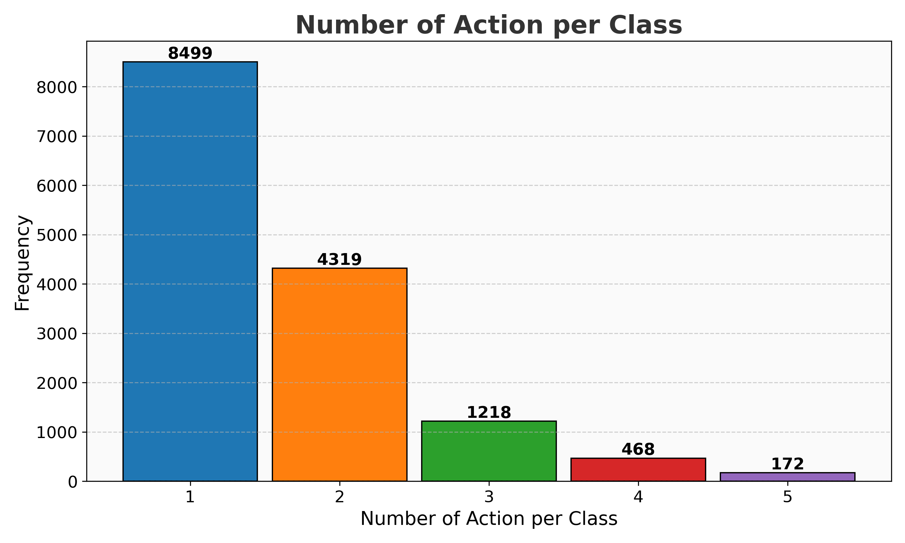
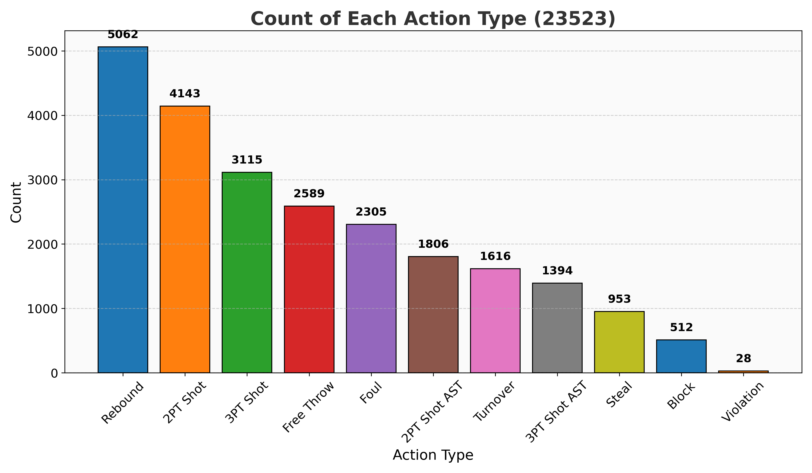

# 🏀👁️ BARD: A Basketball Action Recognition Dataset for multi-labeling classification 👁️🏀

## 📄 Abstract

In this work, we present the BARD dataset. It is designed
to advance Basketball Action Recognition task. Our contributions in-
clude significantly improved annotation accuracy and the integration of
additional variables, such as player jersey numbers and team color in-
formation with respect to existing datasets. We also introduce a novel
output format that supports multi-class classification tasks. Finally, we
conducted a human validation study on a subsample of the annotations,
with expert reviewers assessing the labeling quality and reporting the
evaluation results.

### 📘 Summary

| Property           | Value                     | Description                                 |
|--------------------|---------------------------|---------------------------------------------|
| Season             | 2024–2025                 | Most updated season                         |
| Teams              | 30                        | Selected NBA teams                          |
| Games              | 60                        | Total number of games sampled               |
| Initial clips      | 24,692                    | Raw video segments collected                |
| Final clips        | 14,676                    | After filtering and consolidation           |
| Resolution         | 720p                      | High-definition video                       |
| Labels             | Structured JSON           | Multiclass based labels                     |
| Action recognition | Coarse and Event          | Play-by-play annotation                     |
| New fields         | Player numbers, team colors | Anonymous identification metadata         |






#### 🏀 Example Clip & Label

**🎥 Clip:**  
[Green Tip Layup Shot (21 PTS)](https://www.nba.com/stats/events/?CFID=&CFPARAMS=&GameEventID=632&GameID=0022401228&Season=2024-25&flag=1&title=Green%20Tip%20Layup%20Shot%20(21%20PTS))

**📝 Multi-label Annotation:**

```json
[
  { "player": "0", "action": "2PT Shot", "result": false, "assisted": false, "other_player": null, "color": "blue" },
  { "player": "23", "action": "Rebound", "result": null, "assisted": null, "other_player": null, "color": "blue" },
  { "player": "23", "action": "2PT Shot", "result": false, "assisted": false, "other_player": null, "color": "blue" },
  { "player": "23", "action": "Rebound", "result": null, "assisted": null, "other_player": null, "color": "blue" },
  { "player": "23", "action": "2PT Shot", "result": true, "assisted": false, "other_player": null, "color": "blue" }
]


##### 💻 File Execution Order

1. get_players.py
   Retrieve player names and info for the current season.

2. get_pbp_address.py
   Fetch URLs of game play-by-play data that you want to analyze.

3. get_data.py
   Download and save detailed game data from the URLs obtained.

3.1 get_data_failed.py
   Use the script if any file was not correctly downloaded

4. Update referee.csv
   Manually update data/referee.csv with the latest referee information from one of these sources:
   - https://www.basketball-reference.com/referees/2025_register.html
   - https://www.nbastuffer.com/2024-2025-nba-referee-stats/

5. substitue_player_number.py
   Replace player numbers in the datasets.

6. make_coarse.py
   Generate coarse label

7. make_multilabel.py
   Create multilabel annotations from the coarse data.

8. make_json_and_csv.py
   Convert the processed data into JSON and CSV formats for easy usage.

9. make_stats.py
   Compute detailed player and team statistics based on the prepared datasets.

10. run_gemini.py
    Run the final analysis or machine learning model (e.g., Gemini) to interpret or predict basketball stats.

11. compare_gemini.py  
    Compare Gemini results against benchmark statistics to evaluate model accuracy.

12. compare_gemini_action_dependent.py  
    Compare Gemini results against benchmark statistics to evaluate model accuracy starting from action identification